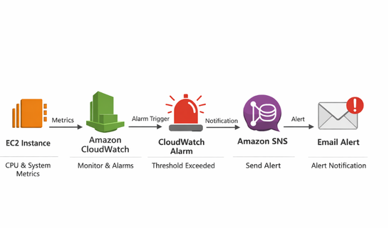

# EC2 Monitoring and Alert System | AWS CloudWatch, SNS


---

## Project Overview

Designed and implemented an AWS based monitoring system for EC2 instances.

The system tracks CPU usage using CloudWatch and sends real time alerts through SNS when usage crosses defined thresholds.

Focused on proactive monitoring and quick response.

---

## Key Impact

* Enabled real time EC2 monitoring
* Automated alerts using CloudWatch and SNS
* Reduced manual monitoring effort
* Improved response time to high usage
* Built scalable alert system

---

## Architecture



Flow

EC2 → CloudWatch Metrics → CloudWatch Alarm → SNS → Email Notification

---

## AWS Services Used

* Amazon EC2
* Amazon CloudWatch
* Amazon SNS

---

## Features

* Monitor CPU utilization
* Threshold based alerts
* Instant email notifications
* Automated monitoring setup
* Scalable design

---

## Workflow

1. EC2 sends metrics to CloudWatch
2. CloudWatch tracks CPU usage
3. Alarm triggers when threshold exceeded
4. SNS sends email alert

---

## Project Structure

```id="q2f6lk"
.
├── Screenshots/
├── Architecture.png
├── Setup & steps.md
├── README.md
└── LICENSE
```

---

## Setup Instructions

Detailed steps available in

Setup & steps.md

Quick steps

* Launch EC2 instance
* Configure CloudWatch metrics
* Create alarm with threshold
* Create SNS topic
* Subscribe email and confirm
* Attach SNS to alarm

---

## Testing

* Generate load on EC2
* Alarm moves to ALARM state
* Email alert received

---

## Screenshots

Refer to Screenshots folder for setup and alerts

---

## What You Learn

* CloudWatch monitoring
* SNS alerting
* AWS system observability
* Event based alert system

---

## Challenges Solved

* Configured alarm thresholds
* Connected SNS with CloudWatch
* Verified alert delivery
* Tested under load

---

## Future Improvements

* Add memory and disk alerts
* Integrate Slack notifications
* Add dashboard for metrics
* Enable auto scaling triggers

---

## Outcome

Built an automated monitoring system where EC2 metrics trigger alerts through SNS, improving visibility and response time.


